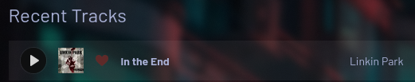
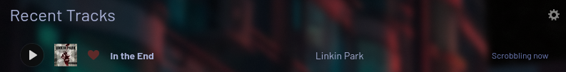

# Scrobbled
Rust bindings for the Last.fm API

# Tutorial
## Important Prerequisite
To make requests to Last.fm you need an API key and secret, which you can get [here](https://www.last.fm/api/account/create). \
Once you have these, make sure to set them in `scrobbled` before making any API requests. To do so:
```rust
#[tokio::main]
async fn main() {
    scrobbled::set_api_key("API KEY");
    scrobbled::set_api_secret("API SHARED SECRET");
}
```

## Authentication
### Token
To make authenticated requests to Last.fm, a "web service session" is required. To obtain one, we first need an auth token:
```rust
let token = scrobbled::auth::get_token().await.unwrap();
println!("{token}"); // abcde...
```
This will open a tab in the user's default browser requesting permission to access their Last.fm account. Once they accept, they will be redirected to a page showing the token, which will automatically be received by `scrobbled` and returned to the caller. Users can close the tab without needing any further action.

### Session
Once we have a token, to get a session and start interacting with the API, create a `Session`:
```rust
use scrobbled::Session;
// Get a session token using the (single-use) auth token
let session = Session::new(token).await.unwrap();
// Ready to go =)
```

## Track Methods
### Scrobbling
Once authenticated, we can scrobble songs to the authenticated user's account. To do so, create a `Scrobble`:
```rust
use scrobbled::Scrobble;
let scrobble = Scrobble::new(
    "In the End",
    "Linkin Park",
    Some("Hybrid Theory"), // Or None
    None // Optionally specify a timestamp here
);
```
To send this to Last.fm, pass your `Scrobble` to the `Session`:
```rust
let result = session.scrobble(&scrobble).await.unwrap();
println!("{result:?}"); // scrobble result information
```
If we now go over to Last.fm, we should see a successful scrobble!


### Update Now Playing
Similarly to scrobbling, we can update the now-playing song on a user's Last.fm profile using a `Scrobble`:
```rust
use scrobbled::Scrobble;
let nowplaying = Scrobble::new(
    "In the End",
    "Linkin Park",
    Some("Hybrid Theory"), // Or None
    None // No need to specify a timestamp for now-playing
);

let result = session.update_now_playing(&nowplaying).await.unwrap();
println!("{result:?}"); // some information back from the API
```

